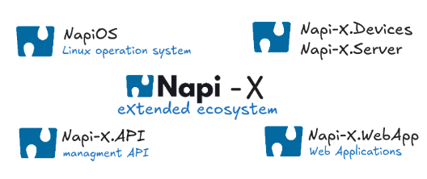
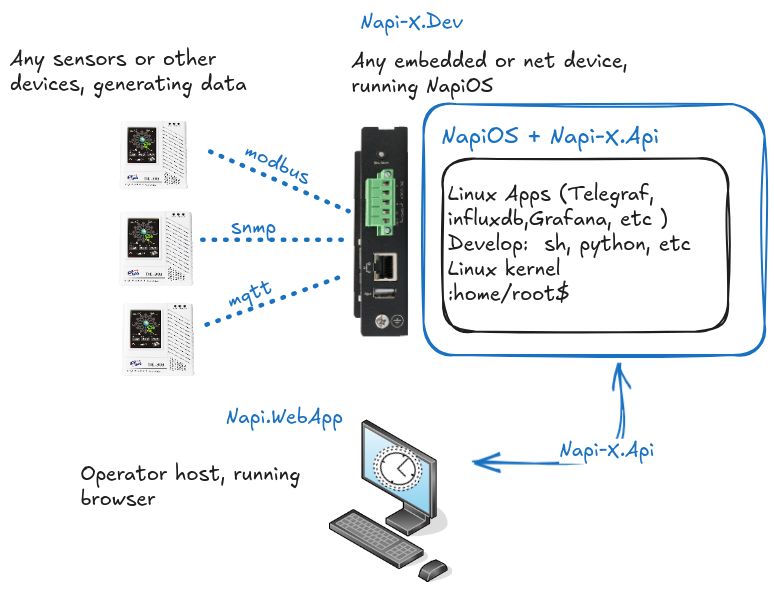
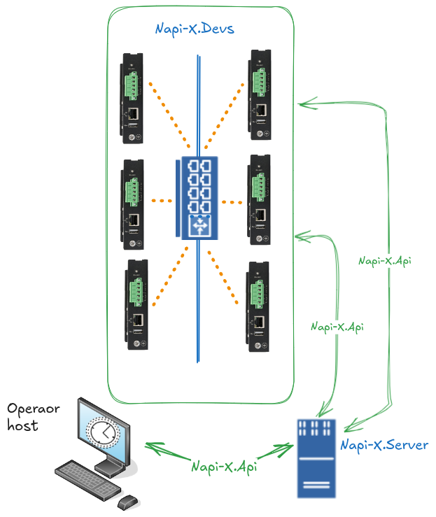
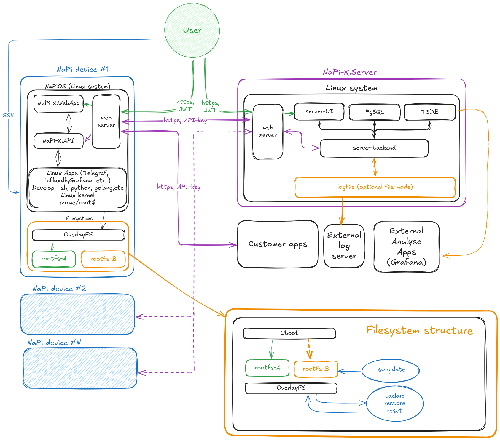
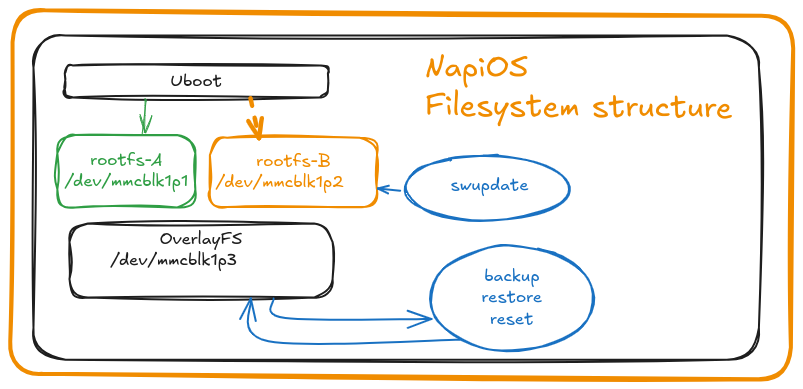

# Napi-X Ecosystem

<!-- :fire: ***Everything you need to manage embedded and network devices***:fire: -->

>:fire: **Look at [screenshots](/whitepaper/screenshots/) of Napi.App** \
>:fire: **Why Napi-X. Our [manifest](/blog/2025/01/09/index).**

## What is Napi-X

>***Everything you need to manage embedded and network devices***

Out team is working hard on the development of:

- The NapiOS operating system from scratch with integrated embedded futures;
- Powerful API for managing devices with NapiOS;
- Web applications for convenient access to the management interface.

### Components of Napi-X

- **Napi-X.OS** — the **NapiOS** operating system, optimized for embedded and networking devices, based on Linux. It includes built-in software for working with sensors and data streams out of the box (Grafana, Telegraf, InfluxDB, Mosquitto).

- **Napi-X.API** — an interface for managing NapiOS's core settings and working with sensors.

- **Napi-X.WebApp** — a web application for device management based on NapiOS.

- **Napi-X.Device** — device, running by NapiOS with Napi-X.Api. Any computer or single-board platform that supports Linux. Single-board computers based on RockChip and NXP chips are well-suite

- **Napi-X.Server** — a server platform for centralized device management under NapiOS. It implements the concept of Software-Defined Device Management (SDDM) and includes a web application for authorizing and managing multiple devices.

## A quick first look

This is what a Napi-X looks like with standalone Napi-X.Dev and a possible workflow in real life.

This is what a Software-Defined Device Management (SDDM) system looks like. The operator manages multiple devices from a single interface and can perform identical actions on all devices simultaneously.

### Napi-X Architecture Diagram

This is the interaction architecture of components in the NApi-X system operation.

## NapiOS - the operating system

:::note

NapiOS is a fully open system with accessible Linux packages, development environments, and the full range of Linux's capabilities. This is "the heart" of Napi-X Ecosystem.

:::

The main distinction of NapiOS from traditional distributions (Debian, Ubuntu, DietPi) is the presence of duplicate system partitions and a separate partition for user data (overlay fs).

This provides the following key benefits:

    Firmware updates with the ability to revert to the previous version.
    Fast backup and restoration of user data only (overlay fs).
    The ability to reset to default settings without reinstalling the system.

We make Linux simple and enjoyable for use in embedded systems.

### Special features of NapiOS for embedded and network devices

The system can boot either from partition 1 (/dev/mmcblk1p1) or partition 2 (/dev/mmcblk1p2). During a system update, one of the partitions (the older one) is updated. If the update fails, the system will boot from the other partition. Partition 3 (/dev/mmcblk1p3) is used for user data and contains all configurations, user files, databases, etc. To create a backup, it is not necessary to copy the entire system; backing up this partition is sufficient. To "reset" the system, all you need to do is erase the data in this partition.

### Advantages of This Approach

1. ***Fault Tolerance.*** If a system update fails, the bootloader can switch to the other partition, ensuring the system remains operational without requiring manual intervention.

2. ***Separation of Concerns.*** The system partitions and user data are kept separate, simplifying backups and updates while minimizing the risk of data loss during system updates or resets.

3. ***Efficient Backups***. Since only the user data partition needs to be backed up, the process is faster, consumes less storage space, and simplifies disaster recovery procedures.

4. ***Simplified Reset Process.*** To reset the system to a default state, it is sufficient to erase the user data partition, without affecting the core system functionality.

5. ***Rollback Capability.*** Updates are applied to the inactive system partition, allowing for easy rollback to the previous version in case of issues.

6. ***Improved Update Management.*** With the ability to update one partition while the other remains active, downtime during updates is minimized.

7. ***Enhanced System Reliability.*** The dual-partition approach ensures the system always has a fallback option, reducing the likelihood of complete system failure.

>***This architecture is especially useful in embedded systems, IoT devices, network routers and environments where reliability and ease of maintenance are critical.***
