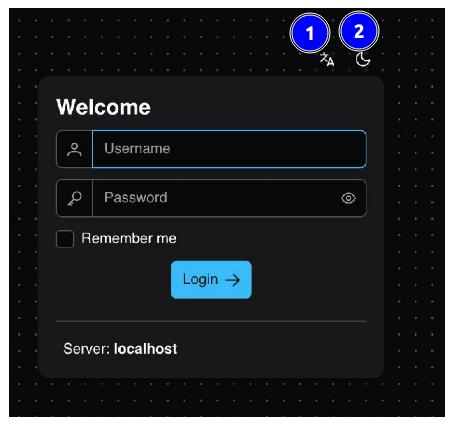
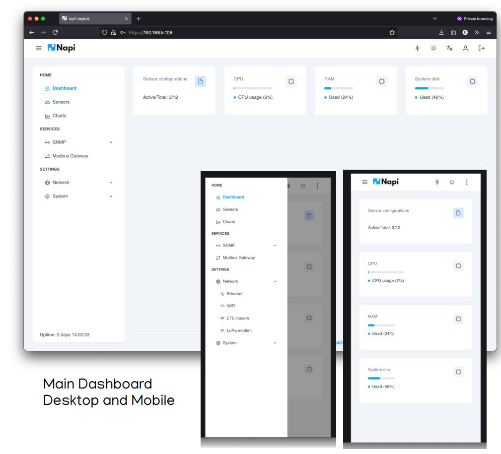
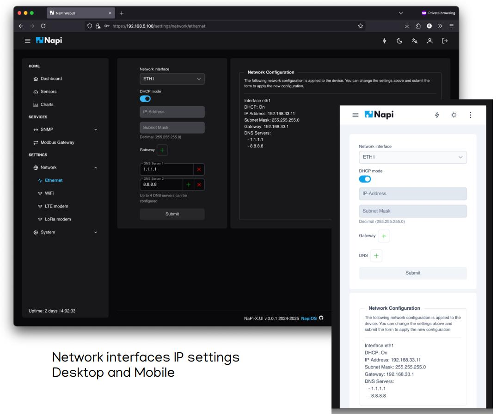
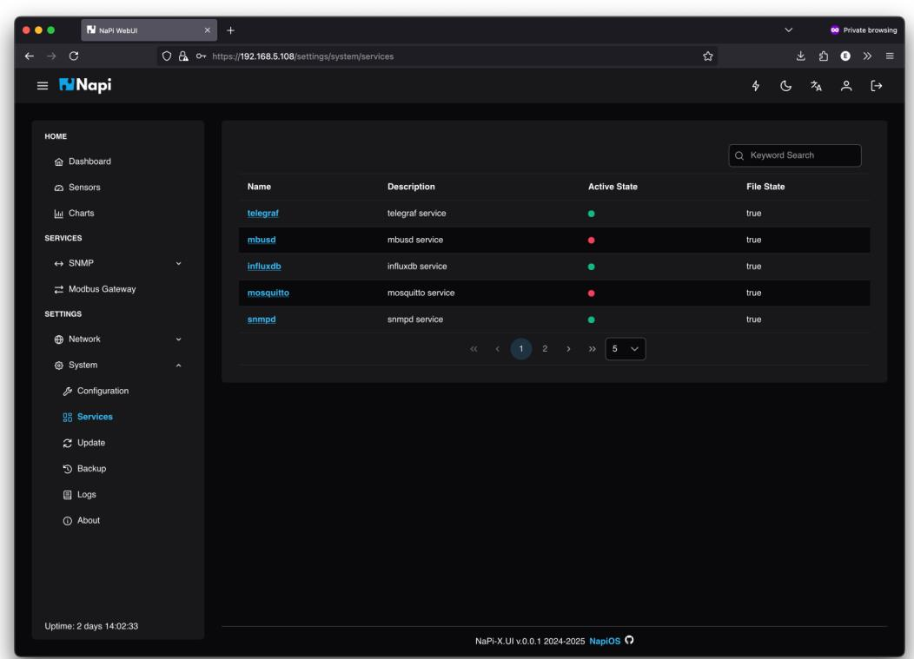
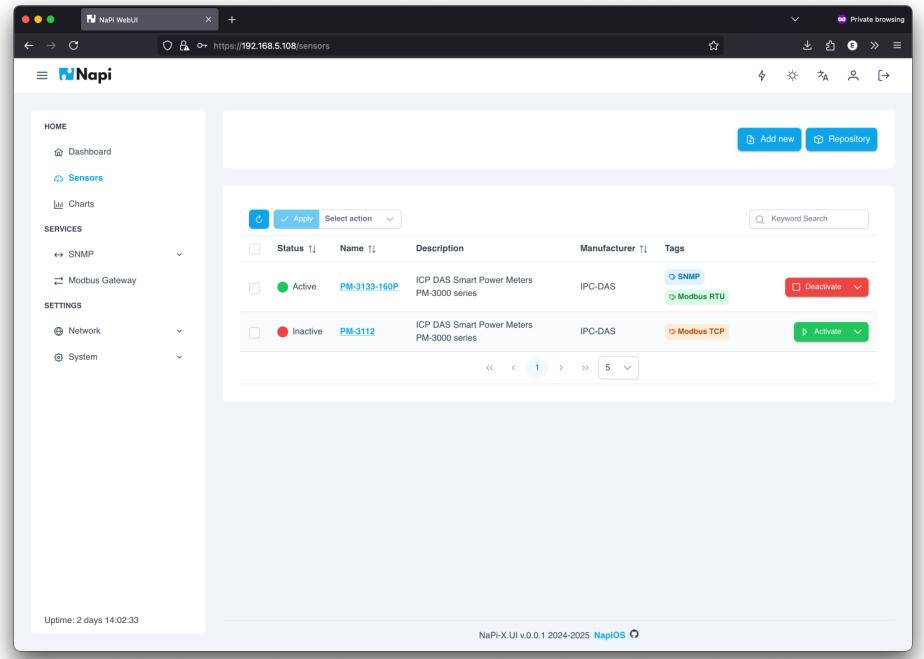
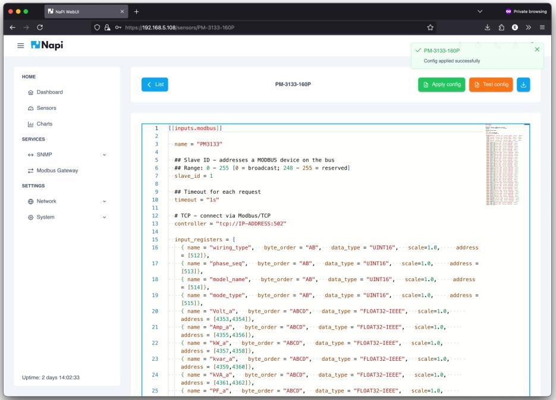

# Screenshots of Napi-X.App

## Standalone Device Management

### Welcome and authorization.

1) Optional change Language (the default language is set based on the OS lang settings)
2) Optional change color Theme (the default language is set based on the OS theme settings)

### Dashboard. Desktop and mobile UI versions.

### Network settings. Desktop and mobile UI versions.

### Linux services management.

### Sensors list.

### Sensor config editing

